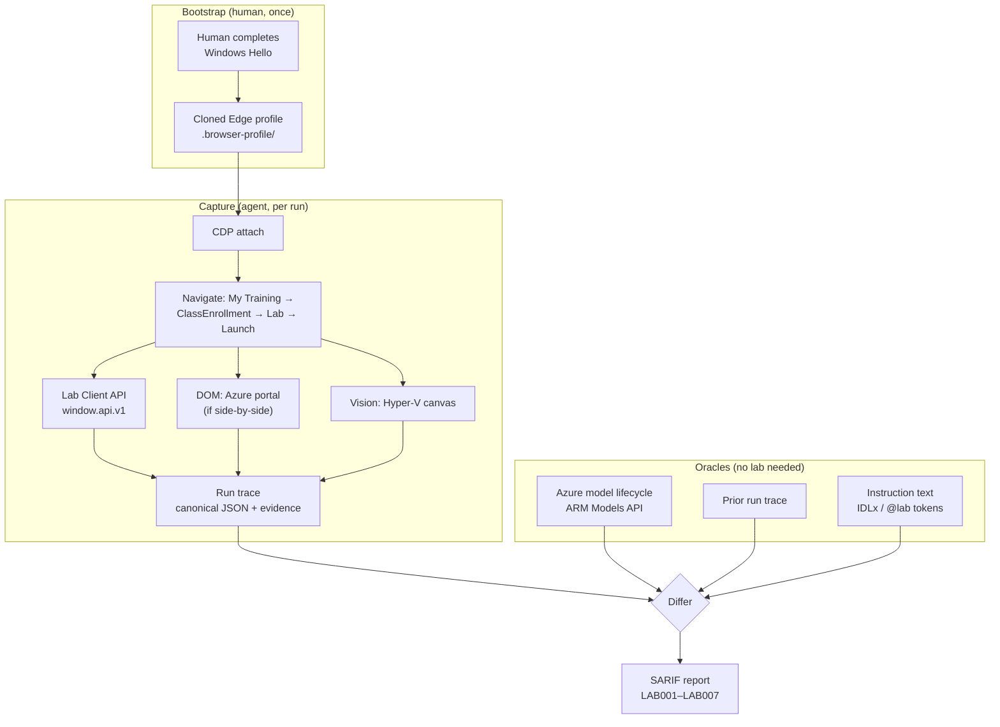

# Lab Validator — approach and reuse guide

**Status:** design settled, harness proven, target lab identified, first launch pending.
**Last updated:** 2026-07-29

---

## 1. What we are building

An agent that drives a browser through a Microsoft Learning Campus hands-on lab the way a
real learner would, and emits a list of places where the **lab instructions no longer match
reality** — retired models, moved or renamed UI, removed features, changed defaults.

The output is a defect report, not a pass/fail. The lab "working" is not the goal; the goal
is a precise, evidence-backed list of instruction lines that have gone stale.

**The single most important framing:** this product is a **differ**, not a test runner. A
test runner asserts against expectations you wrote down. We mostly *cannot* write the
expectations down — nobody maintains a machine-readable spec of what the Azure AI Foundry
UI looked like last quarter. What we can do is capture reality in a stable, canonical form
and compare it against (a) the instruction text and (b) the previous capture.

Everything in this document follows from that. The durable asset is **the capture format**.
The browser automation is scaffolding around it.

---

## 2. What we proved empirically

These are load-bearing facts established by running against the live site, not assumptions.

### 2.1 The platform

`mslearningcampus.com` is **Skillable TMS**, white-labelled for Microsoft. Evidence: page
title `… - Skillable TMS`, footer "Hosted for Microsoft by Skillable", `/Scripts/Enlight.js`.

That identification is what unlocks everything else — it means the documented Skillable
**Lab Client API** (`window.api.v1`) and **Connect LAB API** (`labondemand.com/api/v3`) are
candidate control surfaces, rather than us being stuck with pure screen-scraping.

### 2.2 Authentication — solved, and cheaper than expected

We went through three positions on this and landed somewhere better than where we started:

1. *Store a username and password* — **rejected.** Both Entra ID and MSA enforce MFA here,
   so a stored password cannot complete a sign-in. Storing it buys nothing and costs a
   secret to protect.
2. *Passkeys make this impossible to automate* — **wrong, and it mattered.** Both accounts
   land on `…/fido/…` (Windows Hello). That is hardware-bound and genuinely un-automatable.
   But it is a **one-time human gesture**, not a per-run blocker.
3. *Sign in by hand once, then attach* — **this is the answer.**

The working pattern:

- Clone an Edge profile into a repo-local directory, launch it with
  `--remote-debugging-port`, and let the human complete Windows Hello **once** in a
  visible window.
- The agent then **attaches over CDP** for every subsequent run. No credential is ever
  stored by us. The session lives in the profile, protected by Windows DPAPI, exactly as
  Edge would protect it anyway.

Confirmed working: cookie count went 41 → 69 across 11 domains after one Hello gesture,
and the Learning Campus header flipped from `Login` to the signed-in `Ha ▾` menu.

**Consequence for the design:** we need no secret store for the primary path at all. The
credential model is *"the agent borrows a browser the human already trusted."*

### 2.3 Browser-attach mechanics (the fiddly bits worth remembering)

| Fact | Why it matters |
|---|---|
| **Chrome/Edge 136+ refuse `--remote-debugging-port` on the *default* user-data-dir** | You cannot drive the user's live Edge in place. Cloning to a separate dir is **mandatory**, not a nicety. |
| Cookie-decryption key lives in `User Data\Local State` → `os_crypt.encrypted_key`, DPAPI-bound to the Windows user | Must be copied alongside the profile. The clone only works for the **same user on the same machine** — which is a security *feature*. |
| Cookies are at `<Profile>\Network\Cookies` (Edge 96+) | Not the profile root. Easy to miss. |
| Allow-list copy = **6 MB**; full mirror = **1 640 MB** | `WebStorage` (597 MB) and `IndexedDB` (533 MB) dominate. A 273× reduction — the difference between a usable workflow and an unusable one. |
| `Login Data` (saved passwords) deliberately **not** copied | The agent gets a session, never a credential. |
| Delete `Last Session` / `Last Tabs` / `Current Session` / `Current Tabs` | Avoids the "restore pages?" interstitial hijacking the first navigation. |
| `--disable-popup-blocking` required | Skillable launches the lab via `window.open`. |

### 2.4 The target lab — and why it is the hard case

Discovered by walking the signed-in UI:

| | |
|---|---|
| TMS user | Ha Duong, id **3399370** |
| Enrollment | `/ClassEnrollment/`**5928204** |
| Class | `/Class/`**763682** — WorkshopPLUS · Azure AI Platform and Services |
| Lab | `/Lab/`**79233**`?instructionSetLang=en&classId=763682` |
| Edition | Azure AI: Platform and Services — All Modules (**2026031B**) |
| Duration | **96 hours** |
| Virtualization Platform | **Hyper-V** |
| Cloud Platform | **Azure** |

Two findings here are architecturally significant:

**(a) Entitlement is via WorkshopPlus → My Training, not the catalog.**
`/Course/BrowseOnDemand` returns *"Sorry, no courses are currently available to you"* even
unfiltered. Lab discovery must go through `/User/CurrentTraining/{userId}`. A validator that
crawled the catalog would have concluded there were zero labs.

**(b) The lab is Hyper-V *and* Azure — resolved on 2026-07-29 as *jumpbox*.**

The research treated Cloud Slice and Virtualization as either/or. This lab listed both, so
we launched it to find out. Answer: **jumpbox**.

- `getEnvironmentConnectionStatus()` returns
  `{environment_type: "machine", machine_id: 344479, status: "connected"}`.
- Instruction line 996 references `C:/Users/Admin/Desktop/LABS/Lab 05 - Fine-Tuning`, and
  line 987 says "Go to https://portal.azure.com" — i.e. the Azure portal is opened from a
  browser *inside* the VM.

So the Azure work is **behind the pixel canvas**, and any agent that actually *performs*
lab steps needs vision for essentially the whole run.

**This is much less bad than it sounds**, and the reason is §3.3: the highest-value defect
class — wrong, retired or non-existent models — is caught by **static analysis of the
instruction text plus authoritative API cross-checking, with zero vision and zero VM
interaction**. Run 001 found two invalid model identifiers and a broken table of contents
without a single click inside the VM. Vision is needed to *reproduce* a defect, not to
*find* the most common ones.

### 2.6 The lab client structure (confirmed live)

Launching produces `mslearningcampus.com/Lab/Launch/{labId}` → redirect →
`labclient.labondemand.com/Setup/{instanceGuid}` (provisioning, ~2 min) →
`labclient.labondemand.com/LabClient/{instanceGuid}`.

That final page is a frameset:

| Frame | URL | Contents |
|---|---|---|
| *(top)* | `/LabClient/{guid}` | shell only — **no `window.api`** |
| `#consoleIFrame` | `/VirtualizationClient/{guid}?childClient=1` | 1024×768 `<canvas>` + 1 `<video>` — the Hyper-V console |
| `#instructionsIFrame` | `/Instructions/{guid}` | the instructions, **full DOM** |
| `#contentDialogIFrame` | `about:blank` | dialog host; reaches the API via `window.parent` |

Two consequences that matter:

1. **`window.api.v1` lives in the child frames, not the top frame.** Probing only the top
   page reports `window.api present: False` and would wrongly conclude the Lab Client API
   is unavailable. All 22 documented methods are present in both child frames.
2. **`/Instructions/{guid}` is directly addressable with a full DOM.** Instruction text can
   therefore be extracted **without a Skillable API key** — which removes what looked like
   the project's biggest external dependency.

Useful confirmed calls: `gotoInstructionsPage(i)` (index **clamps to 0** past the end — a
reliable termination signal), `getInstructionsPageIndex()`, `getMinutesRemaining()`
(returned 5760 = 96 h exactly), `getEnvironmentConnectionStatus()`.

Caveat found the hard way: the instructions frame **accumulates** rendered pages. Page 4
came back at 78 KB containing Labs 03–10. Extraction still captures everything, but
per-section attribution must come from the heading structure, not the page index.

### 2.5 Launch gating

The launch button is `display:none` but **`disabled === false`** — a client-side countdown
to the class start, not a server lock. We deliberately did **not** force-click it: the lab
is a 96-hour instance on a real enrolment with one required activity. That is the user's
call, not the agent's.

### 2.7 Driving the VM as a simulated user (run 002)

Everything below was found by actually walking "Required Lab Setup" inside the jumpbox.
Each item is a bug we hit, and the fix that is now in the code — these are the things that
will silently produce wrong results if a future run forgets them.

**Coordinate integrity — the canvas lies about its size.**
The console canvas starts at 1024×768 and is **renegotiated to 2000×1472 once the VM
connects**. Any code that caches the initial value mis-aims every click, and the error
grows with distance from the origin, so it looks like flaky UI rather than a bug. Worse,
screenshotting the *iframe* yields a 2000×**1496** PNG because it includes a 24 px console
toolbar, so image coordinates are offset from VM coordinates by exactly that strip.
→ `screen()` screenshots the `<canvas>` element itself, and `click()` reads
`resolution()` live on every call. Image pixels now map 1:1 onto VM pixels, which is what
makes "read a coordinate off a screenshot and click it" safe.

**`sendTextToEnvironment` resolves before the VM has consumed the text.**
It replays keystrokes into the remote session asynchronously. With a fixed 500 ms settle,
pressing Enter afterwards submitted only the first few characters — `https://portal.azure.com`
became a Bing search for `https:`. The failure is silent and looks like a typo.
→ the settle now scales with length (`1200 ms + 60 ms/char`). **Never press Enter in the
same breath as typing without a length-aware wait.**

**Prefer Skillable's own "type this" affordance over our injection.**
Credential values on the Resources tab are `span.typeText` elements; clicking one makes the
lab client type it into the VM. Using that (`type_credential_natively()`) takes our code
out of the trust path — when a login fails you can state with certainty that the string was
byte-for-byte what a human would have got, instead of suspecting your own automation. We
used exactly this to clear ourselves during the sign-in failure below.

**A modal dialog on the top frame freezes the whole client.**
`#modalDialog` lives on the *top* frame and swallows pointer events for every frame beneath
it. An unhandled one makes the next unrelated click fail with
`<div class="dialog-header"> … intercepts pointer events` — an error that names the wrong
element and points at the wrong problem entirely.
→ `dismiss_dialog()` runs at the head of every tab switch. It returns the dialog text,
which is worth reading rather than blindly dismissing (see next item).

**Read the dialog before refreshing credentials.**
`Refresh Credentials` is not free. Its confirmation says *"The current credentials are valid
for another 7 Hr 39 Min. Are you sure you want to refresh?"* — i.e. the dialog hands you the
remaining validity, which is the single most useful fact for deciding whether a sign-in
failure is a credential problem at all. It was not; refreshing would have burned a valid
set and destroyed the evidence.

**Entra replication lag looks exactly like a broken lab — this is the precision problem.**
A freshly provisioned Cloud Slice user returned *"We couldn't find an account with that
username"* twice, several minutes apart, and then signed in normally on the third attempt
with an identical string. A naive validator reports "🔴 credentials in the Resources tab are
invalid" and is wrong.
→ **Environment warm-up must be retried with backoff and never reported as a content
defect.** Distinguishing *the lab is wrong* from *the cloud is still catching up* is the
core accuracy problem of this product, not an edge case. Rule of thumb: a defect claim
needs either an oracle (the model-lifecycle API) or a stable, repeated observation — never
a single transient failure.

**Debugging a secret without looking at it.**
To rule out mangled injection we printed a *shape* of each credential — digits → `#`,
letters → `a`/`A`, punctuation kept — plus its length and any non-ASCII codepoints. That
was enough to prove the username was clean (`Aaaa#-########@AAAAAAAAAAA.aaaaaaaaaaa.aaa`,
42 chars, no stray whitespace) without exposing it. Worth keeping as a standard technique.

**Secret hygiene has an automation-shaped hole.**
Bulk DOM enumeration is the most useful recon tool we have and it will happily dump
credential values straight into the transcript — ours did. `artifacts/` is gitignored and
these values are ephemeral, but the habit is the risk.
→ redact at the *enumerator*, not at the call site, and move secrets with
`--type-cred "Scope/Label"`, which carries a value from the Resources tab into the VM
without it ever reaching stdout, a log, or a shell argument.

**CLI ergonomics: independent flags cannot express order.**
`--click A --type X --click B` silently kept only the last `--click` (argparse) and then ran
the fixed sequence click→type, so a click meant to land *before* typing happened *after*.
The step loop needs an explicit ordered action list, not a bag of flags.

---

## 3. Recommended architecture

### 3.1 The control-surface ladder

Always take the highest rung that can answer the question. Every rung down costs an order of
magnitude in reliability.

| Rung | Surface | Use it for | Reliability |
|---|---|---|---|
| 1 | **Out-of-band oracles** (Azure ARM APIs, docs) | "Is `gpt-4-32k` retired?" | Deterministic |
| 2 | **Skillable Connect LAB API** (`labondemand.com/api/v3`) | Fetching instruction text, launching, scoring, teardown | Deterministic |
| 3 | **Lab Client API** (`window.api.v1`) | Navigating instruction pages, reading tokens, activity state | High |
| 4 | **DOM / accessibility tree** (Playwright) | Azure portal, ai.azure.com — *if* side-by-side | Good |
| 5 | **Vision** (screenshot → model → click) | Hyper-V canvas, and everything if jumpbox | Poor |

The mistake to avoid is doing at rung 5 what rung 1 can answer. "Is this model retired?" is
an **API question**, not a screenshot question. Never determine truth by looking at a
picture of a dropdown when an authoritative endpoint exists.

### 3.2 Shape



### 3.3 The run trace is the product

Define one canonical, versioned artifact per run. Everything else — screenshots, HAR, DOM
snapshots — hangs off it as evidence. Sketch:

```jsonc
{
  "schema": "lab-validator/run-trace/v1",
  "lab":   { "id": 79233, "edition": "2026031B", "contentVersion": 2 },
  "class": { "id": 763682, "enrollment": 5928204 },
  "startedUtc": "2026-07-29T08:00:00Z",
  "steps": [
    {
      "instructionRef": "module3/task2/step7",
      "instructionText": "In the model dropdown, select gpt-4-32k",
      "extracted": { "kind": "model", "value": "gpt-4-32k" },
      "observed":  { "kind": "options", "values": ["gpt-4o", "gpt-4o-mini", "o3"] },
      "surface":   "dom",
      "evidence":  ["evidence/m3t2s7.png", "evidence/m3t2s7.dom.json"],
      "verdict":   "LAB003"
    }
  ]
}
```

Why this matters: with a stable trace format, **run N vs run N-1 is a diff**, and the diff
*is* the drift report. You get regression detection for free, and you stop depending on the
agent completing the whole lab — a partial trace still yields real findings for the steps it
did reach. Given that the best published computer-use agents score around **20 % binary
completion on OSWorld 2.0**, and a 100-step lab at 98 % per-step reliability finishes only
**13 %** of the time, *designing so partial runs are still valuable is not optional.*

### 3.4 Defect taxonomy → SARIF

Keep the `LAB001`–`LAB007` codes (retired model, missing resource/SKU, changed UI label,
moved navigation, removed feature, broken link, timing/quota). Emit **SARIF 2.1.0** with
`partialFingerprints` so findings are stable across runs and dedupe in GitHub code scanning.
The instruction file and line become the SARIF `location` — which is what makes this
actionable for whoever maintains the lab content.

Run 002 surfaced a category the original taxonomy missed, so add:

- **`LAB008` — undocumented mandatory step.** The instructions are not *wrong*; they are
  *incomplete*, and the gap blocks progress. The Azure sign-in demanding a **Temporary
  Access Pass** is the canonical example: line 61 says only "sign in with your Azure
  credentials", the Resources tab supplies both a Password and a TAP, and nothing says which
  to use or when. Every learner hits this in the first two minutes.
- **`LAB000` — environment transient, explicitly not a defect.** A reserved non-finding code
  so that retried-and-recovered failures are still *recorded in the trace* without being
  reported. Silently dropping them loses the evidence that the run was noisy; promoting them
  to findings destroys precision. This code is how the differ stays honest about the
  difference.

The taxonomy also needs to record **passes**, not just failures. Run 002 confirmed Task 2
("search Microsoft Foundry") and Task 3 ("Overview → Create a resource") match reality
exactly. A differ with no negative evidence cannot tell "verified correct" from "never
reached", and those two must never collapse into one another.

---

## 4. How to reuse what we already have

This is the part worth being deliberate about. We have four categories of asset.

### 4.1 Code that is already load-bearing — keep and harden

| Asset | Reuse as |
|---|---|
| `src/lab_validator/browser.py` | **The session substrate.** Profile discovery, allow-list cloning, CDP launch/attach. The hardest-won code in the repo, and lab-agnostic — it will not change as the validator grows. |
| `scripts/browser_session.py` | **The recon and bootstrap CLI.** `--list-profiles`, `--launch`, `--signin`, `--status`, `--goto`, `--click`, `--shot`, `--probe`. |
| `src/lab_validator/labclient.py` | **The lab driver.** Frame resolution, `window.api.v1` calls, instruction paging, Resources-tab credentials, dialog handling, and coordinate-correct screen capture / click / type. This is the piece that turns "a lab is open" into "a lab can be walked". |
| `scripts/lab_drive.py` | **The step loop.** `--state`, `--creds`, `--page N`, `--screen`, `--click`, `--type`, `--type-cred`, `--key`, `--wait`. |
| `src/lab_validator/secrets_store.py` | Keep for the **CI fallback path** (headless storageState + DPAPI). Not needed for the attach path, but verified and cheap to retain. |
| `src/lab_validator/config.py` | Extend into the target model (see 4.3). |
| `.gitignore` / `.pre-commit-config.yaml` | The safety net. Already verified to block `.auth/`, `.env`, `*.har`, `trace.zip`, `.browser-profile/`. **Do not weaken these** — evidence artifacts are exactly the kind of thing that leaks tokens. |

### 4.2 Recon techniques to promote from inline scripts into the CLI

During recon we repeatedly hand-wrote the same throwaway Python. Each of these earned its
place and should become a real command:

- **`--links`** — enumerate `(text, href)` pairs. This is what found `My Training`,
  `/Lab/79233`, and the tagId taxonomy after the visible nav proved to be dropdown parents
  that `--click` could not reach.
- **`--dump`** — dump forms, buttons, `data-*` attributes and visibility. This is what
  revealed the launch button was hidden-but-enabled.
- **`--probe`** (exists) — extend it to also emit the **canonical run-trace step**, so recon
  and production share one capture path instead of drifting apart.

Codifying these is not tidiness. Recon *is* the inner loop of this project — every new lab
starts with the same "what is on this page and what can I reach" question.

### 4.2b The step loop needs ordered actions, not flags

`lab_drive.py` currently applies its flags in a fixed order (click → type → key → wait →
screen) and argparse keeps only the last occurrence of each. That cannot express
"click, type, click again", and it fails *silently* in the wrong order rather than erroring.

Replace the flag bag with an explicit sequence — the natural unit is one instruction step:

```
python scripts/lab_drive.py --do "click 1000,733" "cred Azure Portal/TAP" \
                            "click 1121,858" "wait 15000" "shot tap-signin"
```

Each verb then becomes a run-trace entry for free, which is the point: the executor and the
capture format should be the same list, not two parallel ones that drift.

### 4.3 Discovered IDs → declarative targets, never hardcoded

We now know user `3399370`, class `763682`, enrollment `5928204`, lab `79233`. These must
**not** get baked into code. Put them in a target descriptor, e.g.
`targets/azure-ai-platform.toml`:

```toml
[target]
name    = "WorkshopPLUS - Azure AI Platform and Services"
lab_id  = 79233
edition = "2026031B"

[discovery]
# Prefer discovery over hardcoding; the IDs are a cache/assertion, not the source of truth.
route      = "my-training"     # /User/CurrentTraining/{userId}
class_id   = 763682
enrollment = 5928204

[expect]
virtualization  = "Hyper-V"
cloud_platform  = "Azure"
content_version = 2
```

Two payoffs. First, adding a second lab becomes a data change. Second — and this is the
subtle one — **`content_version` and `edition` in the descriptor turn into a drift signal
themselves.** If Skillable ships `2026031C`, the validator should say so loudly, because
that is the single strongest prior that instructions changed.

### 4.4 Knowledge artifacts

The session-artifact documents are the reasoning record and should be treated as source
material, not scratch:

- `research/i-need-to-create-a-lab-validator-lab-is.md` — the 666-line report: platform
  evidence, control-surface ladder, oracles, taxonomy, SARIF, phased plan.
- `research/recon-target-lab.md` — the live recon capture that produced §2.4 above.
- `skillable-docs/` (~40 pages + 2 OpenAPI specs) — **offline cache.** Includes
  `docs__lab-client-api-for-lab-delivery-customization.md`, `apidocs__launch-a-lab-1.md`,
  `docs__replacement-tokens.md`, `Skillable-lab-OpenAPI.yaml`. Keep it: it is the reference
  for `window.api.v1` and `/api/v3` without round-tripping to the web mid-run.

---

## 5. What to build next

Ordered by *unblocked now* first, because the lab launch is gated.

### Unblocked today — no lab instance required

1. **Azure model-lifecycle oracle.** The highest-value, most deterministic component, and it
   needs nothing but an Azure subscription.

   ```
   GET https://management.azure.com/subscriptions/{id}/providers/
       Microsoft.CognitiveServices/locations/{loc}/models?api-version=2024-10-01
   ```

   Read `lifecycleStatus` and `deprecation.inference`. Auth via `DefaultAzureCredential` —
   **no stored secret.**

   > ⚠️ **Vocabulary trap, do not get this wrong.** In the API, `Deprecated` means what the
   > portal calls **Retired**, and `Deprecating` means what the portal calls **Deprecated**.
   > Never string-match on the word "deprecated". Compare `deprecation.inference` against
   > the run timestamp instead.

2. **Instruction linter + SARIF emitter, against fixtures.** The rule engine for
   `LAB001`–`LAB007` and the SARIF writer can be built and unit-tested now using
   hand-written IDLx fixtures. When real instruction text arrives it plugs straight in.

3. **Run-trace schema v1** (§3.3) plus a writer. Do this *before* the first real run so the
   first run is captured in the canonical format and becomes a usable baseline.

4. **Promote `--links` / `--dump` into the CLI** (§4.2).

5. **Commit.** Nothing is committed yet beyond the initial commit. The harness is verified
   and lint-clean; it should be on `main` before launch-day work starts.

### Gated on the first launch

6. **`--probe --all-tabs` against a live instance.** Answers, in one shot: is `window.api.v1`
   exposed and with which methods; is the VM a `<canvas>` or a separate window; **jumpbox or
   side-by-side**. Every remaining UNVERIFIED item in the research report collapses here.

7. Route selection based on (6): DOM-first executor if side-by-side, vision-first if jumpbox.

### Worth resolving out of band

8. **Ask whether a Skillable API key / Lab Profile ownership is available.** This is the
   biggest possible simplification in the whole project: `/GetLabInstructions` would give us
   the authoritative instruction text directly, letting the static pre-flight checks run
   with **zero browser automation** — and static checks are where most "model retired"
   defects actually get caught. There is also a free integration-testing tier (5 concurrent,
   30-minute cap, non-billable) that would remove the 96-hour-instance problem entirely.

---

## 6. Open questions

**Resolved by validation run 001 (2026-07-29):**

- ~~Jumpbox or side-by-side?~~ → **Jumpbox** (§2.4b).
- ~~Is `window.api.v1` exposed?~~ → **Yes**, in the child frames, all 22 methods (§2.6).
- ~~Can instruction text be obtained without an API key?~~ → **Yes**, `/Instructions/{guid}`
  is directly readable (§2.6). This substantially reduces the value of chasing an API key.

**Still open:**

- Does anyone hold a Skillable API key or own these Lab Profiles? Still useful for
  *launching* labs cheaply (free integration tier: 5 concurrent, 30-min cap, non-billable),
  even though it is no longer needed to read instructions.
- Is a 96-hour instance re-launchable, or is the single required activity one-shot? Governs
  how freely we can iterate.
- **Is there an authoritative machine-readable lifecycle feed for Azure OpenAI *API
  versions*?** Run 001 could not check `2024-05-01-preview` / `2024-12-01-preview` for this
  reason. Currently the largest oracle gap.
- What is the VM's `Admin` password, and is it exposed via `getLabVariable()` or only in the
  "Access and Credentials" instruction section? Needed before any in-VM step can run.

---

## 7. Principles to hold onto

1. **Highest rung wins.** Never answer with vision what an API can answer.
2. **Partial runs must be valuable.** Reliability maths guarantees most runs end early.
3. **Capture first, judge later.** Record raw observations; run rules over the trace
   offline. Never couple "what did I see" to "is that wrong".
4. **The agent borrows a session, never a credential.**
5. **Version drift is a finding, not just metadata.** A new `contentVersion` or edition code
   is the strongest available prior that instructions moved.
