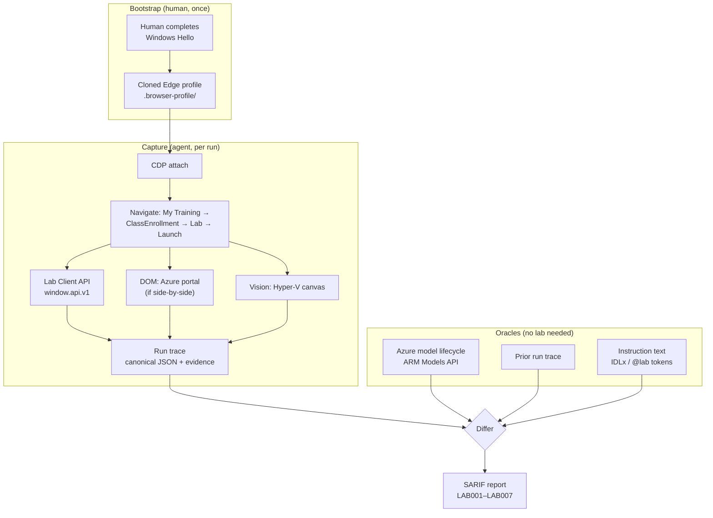

# Lab Validator — approach and reuse guide

**Status:** design settled, harness proven, lab launched and partially walked as a learner.
**Coverage so far:** 1 of 12 modules end-to-end (~3 % of instruction lines executed);
100 % statically analysed. Findings: [`gapanalysis.md`](gapanalysis.md).
**Last updated:** 2026-07-29

---

## 1. What we are building
An agent that drives a browser through a Microsoft Learning Campus hands-on lab the way a
real learner would, and emits a list of places where the **lab instructions no longer match
reality** — retired models, moved or renamed UI, removed features, changed defaults.

The output is a defect report, not a pass/fail. The lab "working" is not the goal; the goal
is a precise, evidence-backed list of instruction lines that have gone stale.

**The single most important framing:** this product is a **differ**, not a test runner. A
test runner asserts against expectations you wrote down. We mostly *cannot* write the
expectations down — nobody maintains a machine-readable spec of what the Azure AI Foundry
UI looked like last quarter. What we can do is capture reality in a stable, canonical form
and compare it against (a) the instruction text and (b) the previous capture.

Everything in this document follows from that. The durable asset is **the capture format**.
The browser automation is scaffolding around it.

---

## 2. What we proved empirically

These are load-bearing facts established by running against the live site, not assumptions.

### 2.1 The platform

`mslearningcampus.com` is **Skillable TMS**, white-labelled for Microsoft. Evidence: page
title `… - Skillable TMS`, footer "Hosted for Microsoft by Skillable", `/Scripts/Enlight.js`.

That identification is what unlocks everything else — it means the documented Skillable
**Lab Client API** (`window.api.v1`) and **Connect LAB API** (`labondemand.com/api/v3`) are
candidate control surfaces, rather than us being stuck with pure screen-scraping.

### 2.2 Authentication — solved, and cheaper than expected

We went through three positions on this and landed somewhere better than where we started:

1. *Store a username and password* — **rejected.** Both Entra ID and MSA enforce MFA here,
   so a stored password cannot complete a sign-in. Storing it buys nothing and costs a
   secret to protect.
2. *Passkeys make this impossible to automate* — **wrong, and it mattered.** Both accounts
   land on `…/fido/…` (Windows Hello). That is hardware-bound and genuinely un-automatable.
   But it is a **one-time human gesture**, not a per-run blocker.
3. *Sign in by hand once, then attach* — **this is the answer.**

The working pattern:

- Clone an Edge profile into a repo-local directory, launch it with
  `--remote-debugging-port`, and let the human complete Windows Hello **once** in a
  visible window.
- The agent then **attaches over CDP** for every subsequent run. No credential is ever
  stored by us. The session lives in the profile, protected by Windows DPAPI, exactly as
  Edge would protect it anyway.

Confirmed working: cookie count went 41 → 69 across 11 domains after one Hello gesture,
and the Learning Campus header flipped from `Login` to the signed-in `Ha ▾` menu.

**Consequence for the design:** we need no secret store for the primary path at all. The
credential model is *"the agent borrows a browser the human already trusted."*

### 2.3 Browser-attach mechanics (the fiddly bits worth remembering)

| Fact | Why it matters |
|---|---|
| **Chrome/Edge 136+ refuse `--remote-debugging-port` on the *default* user-data-dir** | You cannot drive the user's live Edge in place. Cloning to a separate dir is **mandatory**, not a nicety. |
| Cookie-decryption key lives in `User Data\Local State` → `os_crypt.encrypted_key`, DPAPI-bound to the Windows user | Must be copied alongside the profile. The clone only works for the **same user on the same machine** — which is a security *feature*. |
| Cookies are at `<Profile>\Network\Cookies` (Edge 96+) | Not the profile root. Easy to miss. |
| Allow-list copy = **6 MB**; full mirror = **1 640 MB** | `WebStorage` (597 MB) and `IndexedDB` (533 MB) dominate. A 273× reduction — the difference between a usable workflow and an unusable one. |
| `Login Data` (saved passwords) deliberately **not** copied | The agent gets a session, never a credential. |
| Delete `Last Session` / `Last Tabs` / `Current Session` / `Current Tabs` | Avoids the "restore pages?" interstitial hijacking the first navigation. |
| `--disable-popup-blocking` required | Skillable launches the lab via `window.open`. |

### 2.4 The target lab — and why it is the hard case

Discovered by walking the signed-in UI:

| | |
|---|---|
| TMS user | Ha Duong, id **3399370** |
| Enrollment | `/ClassEnrollment/`**5928204** |
| Class | `/Class/`**763682** — WorkshopPLUS · Azure AI Platform and Services |
| Lab | `/Lab/`**79233**`?instructionSetLang=en&classId=763682` |
| Edition | Azure AI: Platform and Services — All Modules (**2026031B**) |
| Duration | **96 hours** |
| Virtualization Platform | **Hyper-V** |
| Cloud Platform | **Azure** |

Two findings here are architecturally significant:

**(a) Entitlement is via WorkshopPlus → My Training, not the catalog.**
`/Course/BrowseOnDemand` returns *"Sorry, no courses are currently available to you"* even
unfiltered. Lab discovery must go through `/User/CurrentTraining/{userId}`. A validator that
crawled the catalog would have concluded there were zero labs.

**(b) The lab is Hyper-V *and* Azure — resolved on 2026-07-29 as *jumpbox*.**

The research treated Cloud Slice and Virtualization as either/or. This lab listed both, so
we launched it to find out. Answer: **jumpbox**.

- `getEnvironmentConnectionStatus()` returns
  `{environment_type: "machine", machine_id: 344479, status: "connected"}`.
- Instruction line 996 references `C:/Users/Admin/Desktop/LABS/Lab 05 - Fine-Tuning`, and
  line 987 says "Go to https://portal.azure.com" — i.e. the Azure portal is opened from a
  browser *inside* the VM.

So the Azure work is **behind the pixel canvas**, and any agent that actually *performs*
lab steps needs vision for essentially the whole run.

**This is much less bad than it sounds**, and the reason is §3.3: the highest-value defect
class — wrong, retired or non-existent models — is caught by **static analysis of the
instruction text plus authoritative API cross-checking, with zero vision and zero VM
interaction**. Run 001 found two invalid model identifiers and a broken table of contents
without a single click inside the VM. Vision is needed to *reproduce* a defect, not to
*find* the most common ones.

### 2.6 The lab client structure (confirmed live)

Launching produces `mslearningcampus.com/Lab/Launch/{labId}` → redirect →
`labclient.labondemand.com/Setup/{instanceGuid}` (provisioning, ~2 min) →
`labclient.labondemand.com/LabClient/{instanceGuid}`.

That final page is a frameset:

| Frame | URL | Contents |
|---|---|---|
| *(top)* | `/LabClient/{guid}` | shell only — **no `window.api`** |
| `#consoleIFrame` | `/VirtualizationClient/{guid}?childClient=1` | 1024×768 `<canvas>` + 1 `<video>` — the Hyper-V console |
| `#instructionsIFrame` | `/Instructions/{guid}` | the instructions, **full DOM** |
| `#contentDialogIFrame` | `about:blank` | dialog host; reaches the API via `window.parent` |

Two consequences that matter:

1. **`window.api.v1` lives in the child frames, not the top frame.** Probing only the top
   page reports `window.api present: False` and would wrongly conclude the Lab Client API
   is unavailable. All 22 documented methods are present in both child frames.
2. **`/Instructions/{guid}` is directly addressable with a full DOM.** Instruction text can
   therefore be extracted **without a Skillable API key** — which removes what looked like
   the project's biggest external dependency.

Useful confirmed calls: `gotoInstructionsPage(i)` (index **clamps to 0** past the end — a
reliable termination signal), `getInstructionsPageIndex()`, `getMinutesRemaining()`
(returned 5760 = 96 h exactly), `getEnvironmentConnectionStatus()`.

Caveat found the hard way: the instructions frame **accumulates** rendered pages. Page 4
came back at 78 KB containing Labs 03–10. Extraction still captures everything, but
per-section attribution must come from the heading structure, not the page index.

### 2.5 Launch gating

The launch button is `display:none` but **`disabled === false`** — a client-side countdown
to the class start, not a server lock. We deliberately did **not** force-click it: the lab
is a 96-hour instance on a real enrolment with one required activity. That is the user's
call, not the agent's.

### 2.7 Driving the VM as a simulated user (run 002)

Everything below was found by actually walking "Required Lab Setup" inside the jumpbox.
Each item is a bug we hit, and the fix that is now in the code — these are the things that
will silently produce wrong results if a future run forgets them.

**Coordinate integrity — the canvas lies about its size.**
The console canvas starts at 1024×768 and is **renegotiated to 2000×1472 once the VM
connects**. Any code that caches the initial value mis-aims every click, and the error
grows with distance from the origin, so it looks like flaky UI rather than a bug. Worse,
screenshotting the *iframe* yields a 2000×**1496** PNG because it includes a 24 px console
toolbar, so image coordinates are offset from VM coordinates by exactly that strip.
→ `screen()` screenshots the `<canvas>` element itself, and `click()` reads
`resolution()` live on every call. Image pixels now map 1:1 onto VM pixels, which is what
makes "read a coordinate off a screenshot and click it" safe.

**`sendTextToEnvironment` resolves before the VM has consumed the text.**
It replays keystrokes into the remote session asynchronously. With a fixed 500 ms settle,
pressing Enter afterwards submitted only the first few characters — `https://portal.azure.com`
became a Bing search for `https:`. The failure is silent and looks like a typo.
→ the settle now scales with length (`1200 ms + 60 ms/char`). **Never press Enter in the
same breath as typing without a length-aware wait.**

**Prefer Skillable's own "type this" affordance over our injection.**
Credential values on the Resources tab are `span.typeText` elements; clicking one makes the
lab client type it into the VM. Using that (`type_credential_natively()`) takes our code
out of the trust path — when a login fails you can state with certainty that the string was
byte-for-byte what a human would have got, instead of suspecting your own automation. We
used exactly this to clear ourselves during the sign-in failure below.

**A modal dialog on the top frame freezes the whole client.**
`#modalDialog` lives on the *top* frame and swallows pointer events for every frame beneath
it. An unhandled one makes the next unrelated click fail with
`<div class="dialog-header"> … intercepts pointer events` — an error that names the wrong
element and points at the wrong problem entirely.
→ `dismiss_dialog()` runs at the head of every tab switch. It returns the dialog text,
which is worth reading rather than blindly dismissing (see next item).

**Read the dialog before refreshing credentials.**
`Refresh Credentials` is not free. Its confirmation says *"The current credentials are valid
for another 7 Hr 39 Min. Are you sure you want to refresh?"* — i.e. the dialog hands you the
remaining validity, which is the single most useful fact for deciding whether a sign-in
failure is a credential problem at all. It was not; refreshing would have burned a valid
set and destroyed the evidence.

**Entra replication lag looks exactly like a broken lab — this is the precision problem.**
A freshly provisioned Cloud Slice user returned *"We couldn't find an account with that
username"* twice, several minutes apart, and then signed in normally on the third attempt
with an identical string. A naive validator reports "🔴 credentials in the Resources tab are
invalid" and is wrong.
→ **Environment warm-up must be retried with backoff and never reported as a content
defect.** Distinguishing *the lab is wrong* from *the cloud is still catching up* is the
core accuracy problem of this product, not an edge case. Rule of thumb: a defect claim
needs either an oracle (the model-lifecycle API) or a stable, repeated observation — never
a single transient failure.

**Debugging a secret without looking at it.**
To rule out mangled injection we printed a *shape* of each credential — digits → `#`,
letters → `a`/`A`, punctuation kept — plus its length and any non-ASCII codepoints. That
was enough to prove the username was clean (`Aaaa#-########@AAAAAAAAAAA.aaaaaaaaaaa.aaa`,
42 chars, no stray whitespace) without exposing it. Worth keeping as a standard technique.

**Secret hygiene has an automation-shaped hole.**
Bulk DOM enumeration is the most useful recon tool we have and it will happily dump
credential values straight into the transcript — ours did. `artifacts/` is gitignored and
these values are ephemeral, but the habit is the risk.
→ redact at the *enumerator*, not at the call site, and move secrets with
`--type-cred "Scope/Label"`, which carries a value from the Resources tab into the VM
without it ever reaching stdout, a log, or a shell argument.

**CLI ergonomics: independent flags cannot express order.**
`--click A --type X --click B` silently kept only the last `--click` (argparse) and then ran
the fixed sequence click→type, so a click meant to land *before* typing happened *after*.
The step loop needs an explicit ordered action list, not a bag of flags.

### 2.8 Doing the work, not checking reachability (run 003)

Run 002 walked ~3 % of the corpus by checking that things were *reachable*. Run 003 walked
Required Lab Setup plus Lab 01 by *actually executing* them — 1,569 steps, 249 images,
30 standing findings, **6 retracted**. That retraction count is the headline lesson: at this
depth the validator generates false positives faster than it generates findings, and most
of what follows is machinery for not shipping them.

#### Evidence discipline — how we produced (and caught) wrong findings

**A negative claim needs an exhaustive read, not a scrollable one.**
We reported that `AZURE_OPENAI_ENDPOINT` was absent from `.env`, from a screenshot of a
terminal showing a key list. The terminal was **scrolled**. The variable was present all
along; the "repair" we appended produced a duplicate, and the verification grep returning
**two** lines is what exposed it. Two findings had to be withdrawn.
→ **"X is absent" is only provable by an exhaustive measurement.** For files, an explicit
per-key count (`Select-String -Pattern '^KEY=' | Measure-Object`), never a visual scan.
Positive claims can rest on a screenshot; negative ones cannot.

**Clear notebook outputs before executing, or you will grade the author's results.**
`1-evaluation.ipynb` ships **with saved outputs baked in**. We spent real effort explaining
why promptflow logs read `2025-08-17` when the VM clock read `2026-07-29` — the answer was
that we were reading the lab author's run, not ours. It produced a phantom symptom that
never existed on this machine.
→ **Clear All Outputs, restart the kernel, then execute.** Any timestamp in output that
predates the run start is the tell. This is now a mandatory preflight for any notebook step.

**Prove root cause by a *change of error class*, not by the absence of an error.**
The Relevance evaluator failed 404. Swapping one `.env` value changed the failure to a
**400 on an unsupported parameter**. Neither run "passed" — but 404-routing → 400-parameter
proves run A never reached a model and run B did. That is a stronger result than a green
tick, because a green tick can come from a swallowed failure (see below).
→ When a fix does not make a symptom disappear, check whether it **moved**. A moved symptom
localises the cause; a vanished symptom may just mean you stopped looking.

**Run a controlled A/B, and say what was held constant.**
Same cell, same data, same deployment, fresh kernel each time, exactly one variable changed.
Written that way, the finding survives review; written as "I changed some things and it got
better", it does not.

**Measure the option space; do not assume it.**
"Substitute a different model" sounds cheap. Enumerating it: 163 models on the account, 50
with `assistants` capability, 26 of those GA, **zero** third-party (all Marketplace-blocked
by subscription policy), and the newest first-party family rejected by the Agents API.
The recommendation that survived — `gpt-5-mini` works, `gpt-5.6-*` does not — is only
defensible because the space was enumerated rather than sampled.

**A green tick is not evidence, and this cuts both ways.**
Two of the lab's own defects (G-21, G-25) are cells that report success while failing. The
validator must therefore **never** treat the UI's own success signal as the observation.
Read the artifact the step was supposed to produce — the status field, the file, the metric
— not the absence of a red mark.

#### Harness — faults that cost us the run

**Edge's Copilot targets wedge `connect_over_cdp`.**
After a few hours Edge acquires `edge://discover-chat-v2` and `edge://newtab` **browser_ui**
targets plus prerendered `copilot.microsoft.com` iframes. Playwright auto-attaches to every
target and blocks **forever** on those, so every step began burning its full 180 s timeout.
`PUT /json/close` **silently no-ops on `edge://` targets** — they reappear in `/json/list`
unchanged — so they cannot be cleaned up at runtime. Real `page` targets do close.
→ Suppress them at launch (`browser.py: SUPPRESSED_EDGE_FEATURES`) and give `attach()` an
explicit **45 s** timeout so the failure is fast and legible instead of a 180 s hang that
looks like a slow lab.

**Never force-restart the controller browser mid-run — it costs a human.**
Restarting to clear the wedge dropped the Skillable session and ended the run. The
constraints, all confirmed the hard way:
- TMS auth is a **memory-only session cookie**; there is nothing on disk to reuse.
- `https://labclient.labondemand.com/LabClient/<instance>` loaded directly returns
  **"Access Denied"** — the lab client is only reachable *through* the enrolment launch flow.
- Cookies cannot be re-cloned while the user's real Edge is running: the Cookies DB is held
  under an exclusive lock (`[System.IO.File]::Open` → *"being used by another process"*).
- The TMS login page has **no SSO button** — native username/password only.

  → There is **no unattended recovery path.** Drain or work around a wedged browser in
place; treat a restart as ending the run. Budget for this in run planning: the session, not
the lab clock, was the binding constraint.

**Finding the debug browser's root process.** `Get-CimInstance Win32_Process -Filter
"Name='msedge.exe'"`, then take the one whose `ParentProcessId` is *not* itself an msedge
pid and whose `CommandLine` contains `--remote-debugging-port=9222`.

#### Engine defects the run exposed

**A boundary predicate must match the selection predicate it partitions.**
`sections()` selected `level == 1 and h.id`; `_section_end()` terminated on `level == 1`
alone. A level-1 heading *without* an id could therefore end a section that `sections()`
never started, silently mis-slicing the corpus. Segmenter bugs do not raise — they just
attribute findings to the wrong lab.
→ Whenever code splits a sequence, the "where does this end" test must be **the same
predicate** as the "is this a start" test. Worth grepping for as a class.

**Bookkeeping must not require the thing being observed.**
`--start-segment` / `--end-segment` attached over CDP purely to sample the lab clock, so
once the lab was gone we could not even *record* how far we had got — exactly when an honest
checkpoint matters most.
→ The clock is now **best-effort**: sampled if reachable, recorded as `unknown` if not, and
the checkpoint always lands. Generalising: a run log must be writable in every state the run
can be in, including "the target has disappeared".

**Field names must not lie.** `Segment.start_line` / `end_line` held **heading ordinals**,
not source lines — harmless until someone builds a report on them. Renamed to
`start_heading` / `end_heading`, with `Segment.from_dict()` still accepting the old keys:
**run folders are evidence and outlive the code that wrote them**, so a rename must never
make an existing run unreadable.

#### Driving VS Code and notebooks in the VM

- **Cell-by-cell beats Run All**, and it is not close. A failure localises to one cell and
  the traceback *is* the finding. Run All aborts the remainder, so you cannot tell *broken*
  from *never reached* — which is the one distinction the whole product exists to make.
- **Navigate deterministically:** `Escape` → `Ctrl+Home` → `Down` × n → `Ctrl+Enter`.
  Clicking cells is unreliable; keyboard navigation from a known origin is not.
- **Clicking a taskbar icon to switch apps is unreliable** — the VS Code icon failed twice,
  and a second VS Code window sat at a different taskbar slot. Prefer keyboard activation.
- **Coordinate mapping for downscaled evidence.** Full-resolution captures are too large to
  read back, so `view/` copies are written at 1400 px wide against a 2000 px VM canvas:
  **multiply coordinates read off a view copy by ≈1.4286**. Always read the `view/` copy;
  always convert before clicking.
- **`--do` quoting under PowerShell:** single-quote the whole argument, and to emit a literal
  `'` **double it**. Never use a backtick before a quote. Keep typed commands **under
  ~120 chars** — multi-line `foreach` blocks get truncated in transit, so prefer single-line
  expressions.
- **Long notebook output overshoots on scroll**; `scroll:X,Y,DELTA` with a negative delta to
  come back is normal, not a fault.

#### Reading the platform, not just the lab

**Distinguish a lab defect from a platform state.** The single most important finding
(G-08 — the chat models will not deploy) is *not* a typo in the instructions; it is the
interaction between Microsoft's model-retirement policy ("existing customer" is decided
**per subscription**) and Skillable minting a **fresh subscription per instance**. No amount
of DOM diffing finds that. It took an oracle (the lifecycle API), a controlled substitution,
and reading the retirement policy prose.
→ The validator's ceiling is set by its oracles. Budget research time for *why* a step
fails, not just *that* it does — the "why" is what the lab author can act on.

**Dependency floors are a validation surface.** `requirements.txt` pins nothing
(`azure-ai-evaluation>=1.10.0`), the image ships exactly the floor, and the documented
`pip install` therefore **cannot** upgrade it. A stale SDK then rejected the only models the
lab could still deploy. Checking installed-vs-available versions is cheap and found a real
defect.

**State an untested hypothesis as untested.** We did *not* upgrade the SDK to test the fix,
because doing so mid-run would have destabilised the remaining labs. That is recorded in the
finding as an explicit, labelled hypothesis for the lab author to verify — which is more
useful than either silence or a guess dressed as a result.

### 2.9 Harness lessons from the deep-execution run (run 004)

Run 004 is the first run to actually *execute* the labs — `pip install graphrag`, build an
index, run red-team scans — rather than check that pages load. Everything below cost real
time to learn.

#### Reading results

- **Read tracebacks from the saved `.ipynb`, not from the screen.** `Ctrl+S` in VS Code, then
  parse the file on the VM:
  `$nb = Get-Content $path -Raw | ConvertFrom-Json; $nb.cells[N].outputs | %{ $_.text -join ""; $_.traceback -join "`n" }`.
  VS Code truncates long cell output behind a *"Output is truncated. View as a scrollable
  element"* link that cannot be scraped, and screenshots of a wrapped 200-column traceback are
  close to unreadable. The notebook file has the whole thing, in order, losslessly.
- **Redirect rich-console tools to a file.** Anything using `rich` (GraphRAG is the offender
  here) repaints and then *clears* the terminal, so a failure leaves an empty screen.
  `cmd > run.log 2>&1` then tail the log. This turned an unexplainable blank screen into a
  one-line diagnosis twice.
- **`C:\` is not writable on the lab VM.** Scratch files go to `$env:USERPROFILE`.
- **Green does not mean worked.** The single highest-value finding of Lab 09 is a scan that
  prints `Scan completed successfully!` and `Overall ASR: 0.0%` having evaluated *zero*
  attacks. Always look past the exit status to the artefact: file sizes, row counts, the
  actual numbers in the JSON. `0/0` and `0/4` render almost identically to a human and mean
  opposite things.

#### Driving the VM

- **A new VS Code window can be poisoned while the existing one is fine.** `code <file>`
  spawned a second window that failed with *"The editor could not be opened due to an
  unexpected error"* / *"Could not register service worker"*, and reloading it did not help.
  The pre-existing window was healthy. **Open files with `Ctrl+P` inside the window that
  already works**; use `Get-Process -Name Code | Select Id, MainWindowTitle` to tell them
  apart. Do not assume one process per app.
- **Interactive prompts eat queued keystrokes.** Keystrokes typed while a long command runs
  are tty-buffered and execute afterwards — which is usually convenient, and occasionally
  destructive: `az login` blocks on *"Select a subscription and tenant"*, so a queued command
  was consumed as the answer (`Invalid selection`). Screenshot before typing into a terminal
  that might be mid-prompt.
- **Multi-line text sent with `type:` loses its trailing newline.** Follow with `key:Enter`.
- **Clicking a taskbar button toggles.** If the target window is *already* focused, the click
  minimises it, and every keystroke in the same `--do` chain silently goes to whatever was
  behind it. This cost a run of the wrong cell and left a stray `>>` continuation prompt in
  PowerShell. **Screenshot to establish focus before switching windows**, or make the switch
  its own step and verify. A blind `click:<taskbar>` at the head of a chain is not idempotent.
- **`until:quiet:<settle>:<budget>` is not a completion probe.** It returned immediately after
  a `clear` and repeatedly mid-`pip install`, because a terminal that is thinking is visually
  quiet. For long shell operations, prefer a fixed `wait:` plus `shot`, and poll.
- **Coordinate scaling differs per crop, so recompute it.** Evidence is downscaled before
  reading; the view→VM factor is a property of *that* crop, not of the harness. For a 1504×1104
  full screenshot resized to 1300×955 it is **×1.157**; for the older 1128×828 view it was
  ×1.333. Getting this wrong produces clicks that land 100 px off and look like flaky UI.

#### Evidence hygiene

- **Capture secrets by shape, never by value.** To audit a `.env`, print key names and value
  *lengths*: `$p[0] + " = <" + $v.Length + " chars>"`. That is enough to prove a variable is
  present, populated, and the wrong shape — which was exactly the Lab 09 finding — without
  ever writing the secret to the trace.
- **`runs/` stays gitignored.** One early screenshot contains a partial live API key.

#### Discipline

- **Verify, do not predict.** Two findings had to be retracted this run for predicting an
  outcome instead of observing one: `pip install X` *without* `-U` is a **no-op** for an
  already-installed distribution (no upgrade happened), and `prompt-tune --output` resolves
  against **CWD** despite its own `--help` claiming "relative to the project root". Run the
  command, then write the finding.
- **A retraction is cheap; a wrong finding is not.** `lab_run.py --retract SEQ` exists for
  this. Use it the moment evidence contradicts a recorded verdict.
- **Credential lifetime is shorter than lab lifetime, and that is itself a finding.** The lab
  account signs in with a **Temporary Access Pass**; the TAP expires long before the 96-hour
  instance does, and every CLI-derived token dies with it. The failure does not look like an
  auth failure — `!az login` simply hangs forever behind the Windows WAM broker, and the real
  error only appears four cells later. Recovery that works unattended:
  `az config set core.enable_broker_on_windows=false` → `az account clear` →
  `az login --use-device-code --scope <resource>/.default`, then complete
  `https://login.microsoft.com/device` **in the browser on the VM**, where the interactive
  session is still valid even though the TAP is not.

---

### 2.10 Harness lessons from the corpus-completion run (run 005)

Run 005 finished the remaining seven sections — all four Lab 10 database modules and both
optional-lab notebooks. The work shifted from *clicking through portals* to *executing and
repairing code on the VM*, and the lessons follow that shift.

#### `nbconvert` is a far better notebook executor than clicking cells

```powershell
python -m jupyter nbconvert --to notebook --execute --allow-errors `
  --ExecutePreprocessor.timeout=240 --output out.ipynb in.ipynb
```

It runs **every** cell, keeps going past failures (`--allow-errors`), and stores each
traceback in the output file. Summarising is then a two-line PowerShell pass over
`.cells[].outputs`. This is dramatically faster and more reliable than driving the VS Code
UI cell by cell, and it removes the ambiguity between *failed* and *never reached* that
"Run All" creates.

Three traps:

- **`jupyter` may not be on `PATH`** in the VM's PowerShell even when it is installed. Use
  `python -m jupyter …`.
- **"No error output" is not success.** Cells wrapped in `try/except` report clean while
  printing an error string. Always follow up with a text scan:
  `[regex]::Matches($allText,'Error|Traceback|Exception|400').Count`.
- **Windows PowerShell 5.1's `Set-Content -Encoding UTF8` writes a BOM**, and `nbformat`
  rejects it with `NotJSONError: Notebook does not appear to be JSON: '\ufeff{…'`. Write
  patched notebooks with `[System.IO.File]::WriteAllText($path, $json)`, which is UTF-8
  without BOM.

#### Prove a defect by *fixing* it on a scratch copy

The most valuable output of run 005 was not "this lab is broken" but "this lab is broken
**for exactly these N reasons**, and here is the run that proves nothing else is wrong."
The pattern: copy the artifact, apply one minimal fix per known defect, re-run, and record
both the broken and the fixed result. It separates *configuration* defects from *content*
rot — three modules that looked dead turned out to be sound once two `.env` lines were
corrected.

Keep the patches minimal and mechanical so the diff itself is the finding:

```powershell
$j = Get-Content 'x.ipynb' -Raw
$j = $j.Replace('../../../.env','../.env.fixed')
$j = $j.Replace('max_tokens=','max_completion_tokens=')
$j = $j -replace 'temperature\s*=\s*[0-9.]+','temperature=1'
```

Patching **values** rather than removing **keyword arguments** keeps the code shape intact
and avoids `TypeError` from an invalid kwarg.

#### Rewriting a SQL object from its own definition

`object_definition()` returns a `CREATE` form that will not string-match a
`CREATE OR ALTER` pattern, so the obvious "read it, replace a substring, re-run it" fails
with `Msg 2714 There is already an object named …`. The reliable sequence is
`drop procedure …` followed by `exec sp_executesql @definition`.

#### Terminal output lives outside the usual crop

Command results print at **column 0**, outside the `crop((330, …))` used for portal
screenshots. Crop from `x=0` when reading a shell, or the evidence image is blank.

#### Clicking the taskbar button of the already-foreground app *minimises* it

This silently redirected an entire command sequence into the wrong window. Either take a
screenshot to confirm focus before typing, or skip the taskbar click when the target app is
already active.

#### Keep typed lines short

Long `--do type:` payloads wrap in the VM console and can pick up a stray Enter, leaving
PowerShell at a `>>` continuation prompt that swallows everything after it. Split into
several short typed lines — session variables persist between them, so a multi-step
PowerShell pipeline can be built up incrementally and read back at the end.

### 2.11 "Blocked" is a status, not a finding

The single most valuable lesson from the addendum pass, and the one most likely to
generalise to every other lab this engine ever walks.

Lab 08 sat for two runs as one line — *blocked, GraphRAG resource has no deployments*. That
felt like a complete answer: a learner genuinely cannot proceed, so what more is there to
say? Re-opening it produced **six further defects**, each independently fixable, and
**corrected the blocker's own factual claim** (the resource had one deployment, not zero).

The failure mode is specific and worth naming. A blocker terminates *the learner's* path,
so it feels like it terminates *the validator's* path too. It does not. The instructions
past the blocker are still claims about the world, and most of them can be checked without
ever clearing the block:

| Checkable without clearing the blocker | Lab 08 example |
|---|---|
| Does the command still have the shape the lab assumes? | `graphrag init` is interactive; `--query` is now positional |
| Do the tool's **defaults** match what the lab told you to create? | defaults are `gpt-4.1` / `text-embedding-3-large`; the lab said `gpt-4o-mini` / `ada-002` |
| Does the config the lab builds actually reference the things it told you to make? | no `sed` ever sets `model:` |
| Can the prerequisite even be installed on the stated platform? | `litellm==1.92.0` is manylinux-only |
| Does the stated version range match the package metadata? | lab says Python 3.10+; graphrag 3.1.1 needs 3.11+ |
| Is every URL well-formed? | endpoint exported with no `https://` scheme |

None of that needed the lab to run. All of it came from **package metadata and upstream
source at the exact version the lab resolves to** — PyPI's JSON API for wheel/platform and
`requires_python` facts, and the GitHub tree at the matching tag for defaults and CLI shape.
That is a cheap, offline, highly reliable oracle, and it is available for any lab that pins
or installs a package.

Two operational rules follow:

1. **Never let a segment end at `BLOCKED` with a single finding.** Treat the blocker as the
   *first* finding and keep reading. Budget a static pass over the remainder.
2. **Re-verify the blocker's factual claim before publishing it.** G-40 asserted "zero
   deployments"; one `az ... deployment list` showed one. An overstated finding costs more
   credibility than a missing one, because it is the kind of thing a lab author will check
   first and use to dismiss the rest of the report.

There is a reporting consequence too: the `report.py` roll-up should treat a segment whose
only record is `BLOCKED` as **incomplete**, not as covered. Coverage counted by *segments
reached* flatters the run; what matters is whether the instructions in that segment were
each compared against something.

---

## 3. Recommended architecture

### 3.1 The control-surface ladder

Always take the highest rung that can answer the question. Every rung down costs an order of
magnitude in reliability.

| Rung | Surface | Use it for | Reliability |
|---|---|---|---|
| 1 | **Out-of-band oracles** (Azure ARM APIs, docs) | "Is `gpt-4-32k` retired?" | Deterministic |
| 2 | **Skillable Connect LAB API** (`labondemand.com/api/v3`) | Fetching instruction text, launching, scoring, teardown | Deterministic |
| 3 | **Lab Client API** (`window.api.v1`) | Navigating instruction pages, reading tokens, activity state | High |
| 4 | **DOM / accessibility tree** (Playwright) | Azure portal, ai.azure.com — *if* side-by-side | Good |
| 5 | **Vision** (screenshot → model → click) | Hyper-V canvas, and everything if jumpbox | Poor |

The mistake to avoid is doing at rung 5 what rung 1 can answer. "Is this model retired?" is
an **API question**, not a screenshot question. Never determine truth by looking at a
picture of a dropdown when an authoritative endpoint exists.

### 3.2 Shape



### 3.3 The run trace is the product

Define one canonical, versioned artifact per run. Everything else — screenshots, HAR, DOM
snapshots — hangs off it as evidence. Sketch:

```jsonc
{
  "schema": "lab-validator/run-trace/v1",
  "lab":   { "id": 79233, "edition": "2026031B", "contentVersion": 2 },
  "class": { "id": 763682, "enrollment": 5928204 },
  "startedUtc": "2026-07-29T08:00:00Z",
  "steps": [
    {
      "instructionRef": "module3/task2/step7",
      "instructionText": "In the model dropdown, select gpt-4-32k",
      "extracted": { "kind": "model", "value": "gpt-4-32k" },
      "observed":  { "kind": "options", "values": ["gpt-4o", "gpt-4o-mini", "o3"] },
      "surface":   "dom",
      "evidence":  ["evidence/m3t2s7.png", "evidence/m3t2s7.dom.json"],
      "verdict":   "LAB003"
    }
  ]
}
```

Why this matters: with a stable trace format, **run N vs run N-1 is a diff**, and the diff
*is* the drift report. You get regression detection for free, and you stop depending on the
agent completing the whole lab — a partial trace still yields real findings for the steps it
did reach. Given that the best published computer-use agents score around **20 % binary
completion on OSWorld 2.0**, and a 100-step lab at 98 % per-step reliability finishes only
**13 %** of the time, *designing so partial runs are still valuable is not optional.*

### 3.3b Report per section, while the walk is happening

Run 004 changed the reporting model: **every section writes its own report, refreshed after
every step**, into `runs/<ts>/sections/<segment-id>.md`. The roll-up `gap-analysis.md` still
exists and links to them.

Three reasons, in order of how much they cost us before we changed it:

1. **A run that dies at section 9 of 23 should leave nine finished reports behind.** Run 003
   walked 8 sections over ~10 hours and then lost its session; the only deliverable was a
   single roll-up that had to be written afterwards from the raw trace. Every section that
   *did* complete was already worth publishing hours earlier.
2. **Nobody fixes a lab by reading a 30-finding digest.** The person who edits section 5 wants
   section 5's findings, its instruction text, and its screenshots — not a document where those
   are interleaved with twenty-two other sections.
3. **It forces the honesty check to be per-section.** An unfinished section prints *"this
   section is not finished, so absence of findings means nothing"* rather than "no defects
   recorded". The roll-up's coverage table makes that claim globally; the section report has
   to make it locally, where a reader is far more likely to over-read silence as approval.

The renderer is a **pure function of the trace**, so it is regenerated rather than appended to.
That is what makes retraction work: a withdrawn finding disappears from the report and is
re-listed under *Withdrawn findings*, instead of needing an erratum bolted onto text that was
accumulated as the walk went.

Two defects surfaced immediately in the first section report, both worth keeping in mind
because they are the same class of error as the merged diagnostics in §4.2:

- **"Verified correct" was padded with the harness's own bookkeeping** — `settled after 7s`,
  `42 chars`. Those are notes the *driver* emits, not judgements a learner made. The report was
  crediting the run with 13 verifications when 2 had actually been made. Fixed by requiring
  `surface == "analysis"`: a confirmation is something deliberately recorded, never a side
  effect of clicking. The roll-up had the identical bug and was fixed with it.
- **Every evidence row was labelled `shot`** — the action verb rather than what was captured.
  The label is already in the filename, so printing the verb was pure noise.

Both are the same failure: **two different kinds of record sharing one list, so the reader
cannot tell them apart.** It is worth checking for deliberately, because each individual record
was correct — only the grouping lied.

### 3.4 Defect taxonomy → SARIF

Keep the `LAB001`–`LAB007` codes (retired model, missing resource/SKU, changed UI label,
moved navigation, removed feature, broken link, timing/quota). Emit **SARIF 2.1.0** with
`partialFingerprints` so findings are stable across runs and dedupe in GitHub code scanning.
The instruction file and line become the SARIF `location` — which is what makes this
actionable for whoever maintains the lab content.

Run 002 surfaced a category the original taxonomy missed, so add:

- **`LAB008` — undocumented mandatory step.** The instructions are not *wrong*; they are
  *incomplete*, and the gap blocks progress. The Azure sign-in demanding a **Temporary
  Access Pass** is the canonical example: line 61 says only "sign in with your Azure
  credentials", the Resources tab supplies both a Password and a TAP, and nothing says which
  to use or when. Every learner hits this in the first two minutes.
- **`LAB000` — environment transient, explicitly not a defect.** A reserved non-finding code
  so that retried-and-recovered failures are still *recorded in the trace* without being
  reported. Silently dropping them loses the evidence that the run was noisy; promoting them
  to findings destroys precision. This code is how the differ stays honest about the
  difference.

The taxonomy also needs to record **passes**, not just failures. Run 002 confirmed Task 2
("search Microsoft Foundry") and Task 3 ("Overview → Create a resource") match reality
exactly. A differ with no negative evidence cannot tell "verified correct" from "never
reached", and those two must never collapse into one another.

---

## 4. How to reuse what we already have

This is the part worth being deliberate about. We have four categories of asset.

### 4.1 Code that is already load-bearing — keep and harden

| Asset | Reuse as |
|---|---|
| `src/lab_validator/browser.py` | **The session substrate.** Profile discovery, allow-list cloning, CDP launch/attach. The hardest-won code in the repo, and lab-agnostic — it will not change as the validator grows. |
| `scripts/browser_session.py` | **The recon and bootstrap CLI.** `--list-profiles`, `--launch`, `--signin`, `--status`, `--goto`, `--click`, `--shot`, `--probe`. |
| `src/lab_validator/labclient.py` | **The lab driver.** Frame resolution, `window.api.v1` calls, instruction paging, Resources-tab credentials, dialog handling, and coordinate-correct screen capture / click / type. This is the piece that turns "a lab is open" into "a lab can be walked". |
| `scripts/lab_drive.py` | **The step loop.** `--state`, `--creds`, `--page N`, `--screen`, `--click`, `--type`, `--type-cred`, `--key`, `--wait`. |
| `src/lab_validator/secrets_store.py` | Keep for the **CI fallback path** (headless storageState + DPAPI). Not needed for the attach path, but verified and cheap to retain. |
| `src/lab_validator/config.py` | Extend into the target model (see 4.3). |
| `.gitignore` / `.pre-commit-config.yaml` | The safety net. Already verified to block `.auth/`, `.env`, `*.har`, `trace.zip`, `.browser-profile/`. **Do not weaken these** — evidence artifacts are exactly the kind of thing that leaks tokens. |

### 4.2 Recon techniques to promote from inline scripts into the CLI

During recon we repeatedly hand-wrote the same throwaway Python. Each of these earned its
place and should become a real command:

- **`--links`** — enumerate `(text, href)` pairs. This is what found `My Training`,
  `/Lab/79233`, and the tagId taxonomy after the visible nav proved to be dropdown parents
  that `--click` could not reach.
- **`--dump`** — dump forms, buttons, `data-*` attributes and visibility. This is what
  revealed the launch button was hidden-but-enabled.
- **`--probe`** (exists) — extend it to also emit the **canonical run-trace step**, so recon
  and production share one capture path instead of drifting apart.

Codifying these is not tidiness. Recon *is* the inner loop of this project — every new lab
starts with the same "what is on this page and what can I reach" question.

**Now done** (`scripts/lab_discover.py` + `src/lab_validator/discovery.py`). Two design
choices there are worth carrying to anything similar:

- **Split the pure part from the browser.** Parsing anchors into enrolments, slugifying a
  workshop title and rendering the TOML are all pure functions taking already-extracted DOM
  records. That is why 13 tests cover them while the lab session is unavailable — the
  fiddly logic is exactly the part you cannot afford to debug only against a live lab that
  costs a human sign-in to reach.
- **A scaffold must never invent a value.** It writes what it observed and leaves a
  `# TODO` naming how to find each thing it did not. A freshly scaffolded descriptor is
  therefore incomplete *by design* and will not load as runnable. This forced a real
  distinction in `targets.py`: `Target.load()` means "give me something a run can rely on"
  and raises; `Target.inspect()` means "tell me what is wrong with this" and does not.
  Answering "what is still missing?" with an exception would make the onboarding command
  useless at precisely the moment it is needed.

**Two bugs this shook out, both found by running the thing rather than reading it:**

- The training-list URL was a guess (`/Learner/MyTraining`) and it 404s. The real learner
  landing page is **`/User/Dashboard`**. The discriminator that found it is reusable: on an
  unauthenticated session, a **real page behind auth redirects to `/User/Login`, while a
  non-existent one redirects to `/Error/NotFound`**. Probing candidate paths signed *out*
  therefore maps the URL namespace without needing an account at all.
- More seriously, the command reported "no enrolments found" for a page that did not exist.
  Three distinct states — *not signed in*, *page does not exist*, *signed in with nothing
  enrolled* — had been collapsed into one message, each needing a different action from the
  reader. A diagnostic that merges states sends people to debug the wrong problem; they are
  now separate exceptions with separate remedies.

**Five more found by independent review, all genuine, all now fixed with regressions:**

- **A validator that checks key *names* but not value *types* still lets an expectation be
  invented.** `models = "gpt-4o"` instead of `["gpt-4o"]` is the likeliest slip in this file,
  and `list()` silently turned it into six single-letter model names — passing even
  `strict=True`. `SCHEMA` now carries a type per key. (`bool` needs its own guard: it
  subclasses `int`, so a flag where a count belongs would otherwise pass.)
- **`innerText` on a card anchor is multi-line**, and the merge preferred the *longest*
  title — so the blob `"title\n18 Mar 2026\nLaunch"` beat the clean title link. A raw newline
  is illegal in a TOML basic string, so the scaffold wrote a descriptor that could not parse
  and then died in a traceback. Fixed at the source by taking the first non-empty line (on a
  card that *is* the title; on a title link it changes nothing), and defensively by escaping
  the full TOML control-character set.
- **Windows writes BOMs.** Notepad and PowerShell 5.1 both do it by default, and under plain
  `utf-8` a BOM surfaces as `Invalid statement (at line 1, column 1)` — sending the onboarder
  hunting a syntax error that does not exist. Reading as `utf-8-sig` fixes it; a UTF-16 file
  (PS 5.1 `>` redirection) now raises a `TargetError` naming the real cause instead of
  leaking a `UnicodeDecodeError` through every caller.
- **The same merged-diagnostic bug, in the second place I wrote it.** `--list` separated the
  three states carefully; `--scaffold` reported "that enrolment is not in your account" when
  the truth was "this page has no enrolments on it". Writing the principle down did not stop
  me repeating the mistake ten lines away — which is the argument for review, not for more
  principles.
- **Identity, not name.** The "don't clobber a curated descriptor" guard compared *derived
  slugs*, but a curated slug is hand-shortened: this repo ships `azure-ai-platform` while
  discovery derives `azure-ai-platform-and-services`. So `--list` showed the one onboarded
  lab as new, and `--scaffold` would have written a second, blank descriptor beside the
  curated one. Matching on observed `lab.enrollment`/`lab.id` fixes both.

### 4.2b The step loop needs ordered actions, not flags

`lab_drive.py` currently applies its flags in a fixed order (click → type → key → wait →
screen) and argparse keeps only the last occurrence of each. That cannot express
"click, type, click again", and it fails *silently* in the wrong order rather than erroring.

Replace the flag bag with an explicit sequence — the natural unit is one instruction step:

```
python scripts/lab_drive.py --do "click 1000,733" "cred Azure Portal/TAP" \
                            "click 1121,858" "wait 15000" "shot tap-signin"
```

Each verb then becomes a run-trace entry for free, which is the point: the executor and the
capture format should be the same list, not two parallel ones that drift.

### 4.3 Discovered IDs → declarative targets, never hardcoded

We now know user `3399370`, class `763682`, enrollment `5928204`, lab `79233`. These must
**not** get baked into code. Put them in a target descriptor, e.g.
`targets/azure-ai-platform.toml`:

```toml
[target]
name    = "WorkshopPLUS - Azure AI Platform and Services"
lab_id  = 79233
edition = "2026031B"

[discovery]
# Prefer discovery over hardcoding; the IDs are a cache/assertion, not the source of truth.
route      = "my-training"     # /User/CurrentTraining/{userId}
class_id   = 763682
enrollment = 5928204

[expect]
virtualization  = "Hyper-V"
cloud_platform  = "Azure"
content_version = 2
```

Two payoffs. First, adding a second lab becomes a data change. Second — and this is the
subtle one — **`content_version` and `edition` in the descriptor turn into a drift signal
themselves.** If Skillable ships `2026031C`, the validator should say so loudly, because
that is the single strongest prior that instructions changed.

### 4.4 Knowledge artifacts

The session-artifact documents are the reasoning record and should be treated as source
material, not scratch:

- `research/i-need-to-create-a-lab-validator-lab-is.md` — the 666-line report: platform
  evidence, control-surface ladder, oracles, taxonomy, SARIF, phased plan.
- `research/recon-target-lab.md` — the live recon capture that produced §2.4 above.
- `skillable-docs/` (~40 pages + 2 OpenAPI specs) — **offline cache.** Includes
  `docs__lab-client-api-for-lab-delivery-customization.md`, `apidocs__launch-a-lab-1.md`,
  `docs__replacement-tokens.md`, `Skillable-lab-OpenAPI.yaml`. Keep it: it is the reference
  for `window.api.v1` and `/api/v3` without round-tripping to the web mid-run.

---

## 5. What to build next

Ordered by *unblocked now* first, because the lab launch is gated.

> **Status after run 003.** Items 1–7 below are **done** and are kept for the rationale, not
> as a to-do list. The live list is at the end of this section under *Next*.

### Unblocked today — no lab instance required

1. **Azure model-lifecycle oracle.** The highest-value, most deterministic component, and it
   needs nothing but an Azure subscription.

   ```
   GET https://management.azure.com/subscriptions/{id}/providers/
       Microsoft.CognitiveServices/locations/{loc}/models?api-version=2024-10-01
   ```

   Read `lifecycleStatus` and `deprecation.inference`. Auth via `DefaultAzureCredential` —
   **no stored secret.**

   > ⚠️ **Vocabulary trap, do not get this wrong.** In the API, `Deprecated` means what the
   > portal calls **Retired**, and `Deprecating` means what the portal calls **Deprecated**.
   > Never string-match on the word "deprecated". Compare `deprecation.inference` against
   > the run timestamp instead.

2. **Instruction linter + SARIF emitter, against fixtures.** The rule engine for
   `LAB001`–`LAB007` and the SARIF writer can be built and unit-tested now using
   hand-written IDLx fixtures. When real instruction text arrives it plugs straight in.

3. **Run-trace schema v1** (§3.3) plus a writer. Do this *before* the first real run so the
   first run is captured in the canonical format and becomes a usable baseline.

4. **Promote `--links` / `--dump` into the CLI** (§4.2).

5. **Commit.** Nothing is committed yet beyond the initial commit. The harness is verified
   and lint-clean; it should be on `main` before launch-day work starts.

### Gated on the first launch

6. **`--probe --all-tabs` against a live instance.** Answers, in one shot: is `window.api.v1`
   exposed and with which methods; is the VM a `<canvas>` or a separate window; **jumpbox or
   side-by-side**. Every remaining UNVERIFIED item in the research report collapses here.

7. Route selection based on (6): DOM-first executor if side-by-side, vision-first if jumpbox.

### Worth resolving out of band

8. **Ask whether a Skillable API key / Lab Profile ownership is available.** This is the
   biggest possible simplification in the whole project: `/GetLabInstructions` would give us
   the authoritative instruction text directly, letting the static pre-flight checks run
   with **zero browser automation** — and static checks are where most "model retired"
   defects actually get caught. There is also a free integration-testing tier (5 concurrent,
   30-minute cap, non-billable) that would remove the 96-hour-instance problem entirely.

### Next — the live list after run 003

**A. Finish the walk.** 15 of 23 sections are unreached (Labs 02–10, both optional labs).
Requires a human sign-in to launch a fresh instance; see *Never force-restart the controller
browser* in §2.8 for why this cannot be automated away.

**B. Generalise (phase 7C).** The engine is generic; nothing about lab 79233 is in code.
- ~~`targets.py` — a `tomllib` loader so `targets/<slug>.toml` is read rather than
  hand-parsed.~~ → **done**, with validation, `--check-target` and 16 tests.
- ~~`scripts/lab_discover.py` — promote the recon flow into a supported command.~~ →
  **done**, and it now *scaffolds* the descriptor rather than leaving it to be hand-authored
  (§4.2). Verified against ground truth: for enrolment 5928204 it reproduces every
  observable value in the curated descriptor, and emits 10 TODOs for the rest.
- **Prove it on a second WorkshopPLUS lab.** Take it through preflight and setup. *Anything
  that needs a code change to make that work is a generalisation bug — fix it in the engine,
  not the descriptor.* This is the only real test of the split. **Still outstanding**, and
  gated on a sign-in: enrolments can only be enumerated inside an authenticated session.

**C. Housekeeping.** ~~Record Pillow as a dependency.~~ → done. ~~Annotate
`targets/azure-ai-platform.toml`'s `[expect]` block.~~ → done (G-08/G-22 recorded there).

**D. Two experiments worth a disposable instance.** Does `azure-ai-evaluation` ≥ 1.18 emit
`max_completion_tokens` and clear G-26? Does `model-router` accept `max_tokens`? Both are
labelled untested hypotheses in the gap analysis and should not stay that way.

---

## 6. Open questions

**Resolved by validation run 001 (2026-07-29):**

- ~~Jumpbox or side-by-side?~~ → **Jumpbox** (§2.4b).
- ~~Is `window.api.v1` exposed?~~ → **Yes**, in the child frames, all 22 methods (§2.6).
- ~~Can instruction text be obtained without an API key?~~ → **Yes**, `/Instructions/{guid}`
  is directly readable (§2.6). This substantially reduces the value of chasing an API key.

**Still open:**

- Does anyone hold a Skillable API key or own these Lab Profiles? Still useful for
  *launching* labs cheaply (free integration tier: 5 concurrent, 30-min cap, non-billable),
  even though it is no longer needed to read instructions.
- Is a 96-hour instance re-launchable, or is the single required activity one-shot? Governs
  how freely we can iterate. **Now the binding constraint** — run 003 ended when the browser
  session was lost, not when the lab clock expired (§2.8).
- **Is there an authoritative machine-readable lifecycle feed for Azure OpenAI *API
  versions*?** Run 001 could not check `2024-05-01-preview` / `2024-12-01-preview` for this
  reason. Still **the largest oracle gap** after run 003 — every API-version reference in the
  corpus remains unverifiable except by execution.
- Which **second WorkshopPLUS lab** should prove the generalisation in phase 7C?

**Resolved by validation run 003 (2026-07-29/30):**

- ~~What is the VM's `Admin` password?~~ → Not needed. The Resources tab carries every
  credential, and `type_credential_natively()` moves them into the VM without them ever
  reaching stdout.
- ~~Why do promptflow logs carry 2025-08 timestamps?~~ → The notebooks **ship with the
  author's saved outputs**. Clear outputs and restart the kernel before executing (§2.8).
- ~~Can an unavailable model simply be substituted?~~ → Not freely. The deployable set is
  narrow and the Agents API rejects part of it; see gap analysis **G-22**.

---

## 7. Principles to hold onto

1. **Highest rung wins.** Never answer with vision what an API can answer.
2. **Partial runs must be valuable.** Reliability maths guarantees most runs end early.
3. **Capture first, judge later.** Record raw observations; run rules over the trace
   offline. Never couple "what did I see" to "is that wrong".
4. **The agent borrows a session, never a credential.**
5. **Version drift is a finding, not just metadata.** A new `contentVersion` or edition code
   is the strongest available prior that instructions moved.
6. **A defect needs an oracle or a repeated observation** — never a single transient. Run 003
   withdrew 6 of 36 findings; every one came from trusting something seen once.
7. **Negative claims need exhaustive evidence.** "X is missing" is a measurement, not a
   glance (§2.8).
8. **A green tick is not an observation.** Read the artifact the step was meant to produce.
   The labs' own worst defects are cells that succeed while failing — and a validator that
   trusts success signals reproduces the same bug.
9. **Record what was *not* reached, as loudly as what failed.** An absent finding must never
   be readable as a pass. Coverage goes at the top of the report, before any finding.
10. **The run log must be writable in every state the run can be in** — including "the target
    has disappeared". Bookkeeping that depends on the thing being observed fails exactly when
    you need it.
11. **A tool that generates expectations must never invent one.** Emit what was observed and
    mark the rest as unfilled. A plausible guess is worse than a blank, because it will be
    believed — and the run will report a divergence that is really a typo in the descriptor.
    Corollary: **validate types, not just key names.** `models = "gpt-4o"` where a list
    belongs is not a typo the reader will catch; it is six invented model names.
12. **Keep distinct failures distinct.** *Not signed in*, *page does not exist* and *signed in
    with nothing there* need three different actions, so they need three different messages.
    A diagnostic that merges states sends people to debug the wrong problem (§4.2).
13. **Match on identity, not on a name you derived.** Any check that compares a generated
    label against a human-curated one will silently miss, because humans shorten names.
